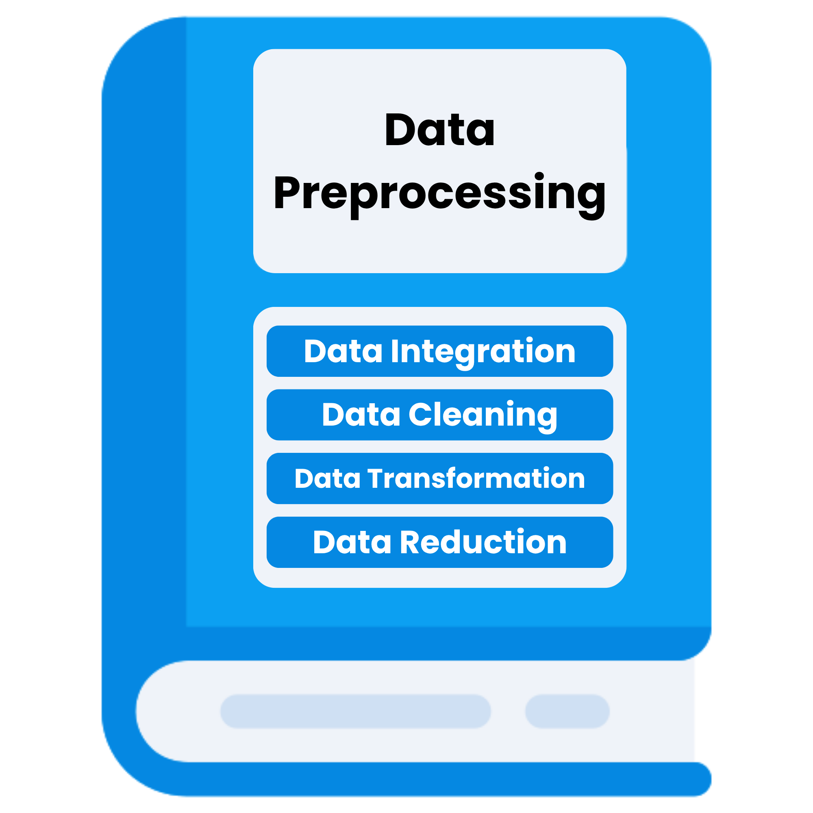
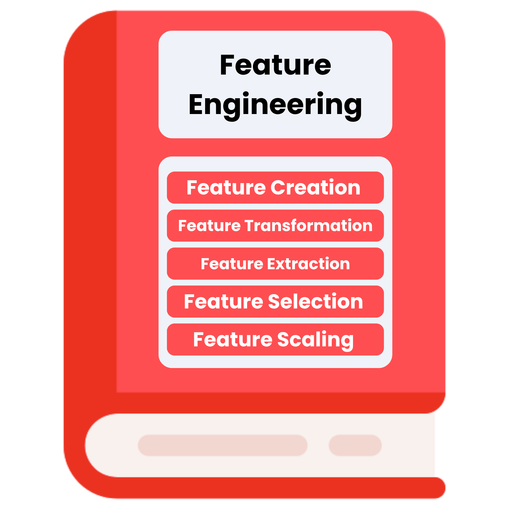

<table>
    <tr>
        <td align="center">
            
        </td>
        <td align="center">
            
        </td>
    </tr>
</table>

# Data_reprocessing_and_Feature_Engineering


This repository contains a collection of data preprocessing and feature engineering techniques, along with their implementations in Python. It serves as a resource for students, researchers, and professionals looking to deepen their understanding of these topics.
It is intended for learning, experimentation, and demonstration of various data preprocessing and feature engineering methods. The code provided is for educational purposes and may not be optimized for production use.

## Contents

- **Data Preprocessing**: This section includes various data preprocessing techniques implemented in Python. Topics covered include data cleaning, transformation, and normalization.
- **Feature Engineering**: This section focuses on feature engineering methods and techniques, with implementations in Python. Topics include feature selection, extraction, and creation.
- **Examples and Use Cases**: Each section contains practical examples and use cases to illustrate the application of the concepts discussed.

## Getting Started

1. Clone the repository:
   ```bash
   git clone https://github.com/Prath-Digital/Data_Preprocessing_and_Feature_Engineering.git
   ```
2. Navigate to the project folder:
   ```bash
    cd Mathematics_and_Advanced_Statistics
   ```
3. Run the Interactive Python Notebooks using Jupyter Notebook or Jupyter Lab:
   ```bash
   jupyter notebook
   ```

## Requirements

- Python 3.10(recommended) or higher

## License

This project is licensed under the MIT License. See the [LICENSE](LICENSE) file for details.

<h1>Mathematics and Advanced Statistics Progress</h1>
<table style="width:100%;border-collapse:collapse;font-family:'cascadia code','Segoe UI',Arial,sans-serif;">
  <thead>
    <tr style="background:#000;color:#fff;">
      <th style="padding:10px 8px;border:2px solid #fff;background:#000;">No.</th>
      <th style="padding:10px 8px;border:2px solid #fff;background:#000;">Topics</th>
    </tr>
  </thead>
  <tbody>
    <tr style="background:#222;color:#fff;">
      <td style="padding:10px 8px;border:2px solid #fff;">1</td>
      <td style="padding:10px 8px;border:2px solid #fff;"><b>Data Analysis</b></td>
    </tr>
    <tr style="background:#fff; color:#000;">
      <td style="padding:10px 8px;border:2px solid #000;">1.1</td>
      <td style="padding:10px 8px;border:2px solid #000;">
        <ul style="margin:0;padding-left:18px;">
          <li><span style="color:#d32f2f;">What is Data Analysis</span></li>
          <li><span style="color:#1976d2;">How to Plan a Data Science Project</span></li>
          <li><span style="color:#388e3c;">Framing a Machine Learning Problem</span></li>
          <li><span style="color:#fbc02d;">What are Tensors</span></li>
          <li><span style="color:#7b1fa2;">Tensor In-depth Explanation</span></li>
        </ul>
        <span style="color:#fff;background:#2e7d32;padding:2px 6px;border-radius:4px;"><a style="color:#fff;text-decoration:none;" href="./Work/ch_1/lec_1.1/">🖥️ Work 🔗</a></span>
      </td>
    </tr>
    <tr style="background:#222;color:#fff;">
      <td style="padding:10px 8px;border:2px solid #fff;">1.2</td>
      <td style="padding:10px 8px;border:2px solid #fff;">
        <ul style="margin:0;padding-left:18px;">
          <li><span style="color:#d32f2f;">Working with CSV files</span></li>
          <li><span style="color:#1976d2;">Working with JSON/SQL</span></li>
          <li><span style="color:#388e3c;">Fetching Data From an API</span></li>
          <li><span style="color:#fbc02d;">Understanding Your Data And Data Cleaning Process</span></li>
        </ul>
        <span style="color:#fff;background:#2e7d32;padding:2px 6px;border-radius:4px;"><a style="color:#fff;text-decoration:none;" href="./Work/ch_1/lec_1.2/">🖥️ Work 🔗</a></span>
      </td>
    </tr>
    <tr style="background:#fff; color:#000;">
      <td style="padding:10px 8px;border:2px solid #000;">1.3</td>
      <td style="padding:10px 8px;border:2px solid #000;">
        <ul style="margin:0;padding-left:18px;">
          <li><span style="color:#d32f2f;">Exploratory Data Analysis</span></li>
          <li><span style="color:#1976d2;">EDA using Univariate Analysis</span></li>
          <li><span style="color:#388e3c;">EDA using Bivariate</span></li>
          <li><span style="color:#fbc02d;">EDA using Multivariate Analysis</span></li>
          <li><span style="color:#7b1fa2;">Pandas Profiling</span></li>
        </ul>
        <span style="color:#fff;background:#2e7d32;padding:2px 6px;border-radius:4px;"><a style="color:#fff;text-decoration:none;" href="./Work/ch_1/lec_1.3/">🖥️ Work 🔗</a></span>
      </td>
    </tr>
    <tr><td colspan="2" style="background:#000;"><hr style="border:1px solid #fff; background:transparent;"></td></tr>
    <tr style="background:#222;color:#fff;">
      <td style="padding:10px 8px;border:2px solid #fff;">2</td>
      <td style="padding:10px 8px;border:2px solid #fff;"><b>PR. 1 Data Profiler</b></td>
    </tr>
    <tr style="background:#fff; color:#000;">
      <td style="padding:10px 8px;border:2px solid #000;">2.1</td>
      <td style="padding:10px 8px;border:2px solid #000;">
        <ul style="margin:0;padding-left:18px;">
          <li><span style="color:#d32f2f;">PR. 1 Data Profiler</span></li>
        </ul>
        <span style="color:#fff;background:#7b1fa2;padding:2px 6px;border-radius:4px;"><a style="color:#fff;text-decoration:none;" href="https://github.com/Prath-Digital/Data_reprocessing_and_Feature_Engineering_PR.-1-Data-Profiler" target="_blank">Code</a></span>
      </td>
    </tr>
    <tr><td colspan="2" style="background:#000;"><hr style="border:1px solid #fff; background:transparent;"></td></tr>
    <tr style="background:#222;color:#fff;">
      <td style="padding:10px 8px;border:2px solid #fff;">3</td>
      <td style="padding:10px 8px;border:2px solid #fff;"><b>Data Cleaning</b></td>
    </tr>
    <tr style="background:#fff; color:#000;">
      <td style="padding:10px 8px;border:2px solid #000;">3.1</td>
      <td style="padding:10px 8px;border:2px solid #000;">
        <ul style="margin:0;padding-left:18px;">
          <li><span style="color:#d32f2f;">Missing Value Imputation</span></li>
          <li><span style="color:#1976d2;">Handling missing Numerical Data - Simple Imputer</span></li>
          <li><span style="color:#388e3c;">Handling missing Categorical Data - Simple Imputer</span></li>
          <li><span style="color:#fbc02d;">Most Frequent Imputation (Missing Category Imputation)</span></li>
        </ul>
        <span style="color:#fff;background:#2e7d32;padding:2px 6px;border-radius:4px;"><a style="color:#fff;text-decoration:none;" href="./Work/ch_2/lec_2.1/">🖥️ Work 🔗</a></span>
      </td>
    </tr>
    <tr style="background:#222;color:#fff;">
      <td style="padding:10px 8px;border:2px solid #fff;">3.2</td>
      <td style="padding:10px 8px;border:2px solid #fff;">
        <ul style="margin:0;padding-left:18px;">
          <li><span style="color:#d32f2f;">Missing Indicator + Random Sample Imputation</span></li>
          <li><span style="color:#1976d2;">KNN Imputer (Multivariate Imputation)</span></li>
        </ul>
        <span style="color:#fff;background:#2e7d32;padding:2px 6px;border-radius:4px;"><a style="color:#fff;text-decoration:none;" href="./Work/ch_2/lec_2.2/">🖥️ Work 🔗</a></span>
      </td>
    </tr>
    <tr style="background:#fff; color:#000;">
      <td style="padding:10px 8px;border:2px solid #000;">3.3</td>
      <td style="padding:10px 8px;border:2px solid #000;">
        <ul style="margin:0;padding-left:18px;">
          <li><span style="color:#d32f2f;">Multivariate Imputation by Chained Equations (MICE Algorithm)</span></li>
        </ul>
        <span style="color:#fff;background:#2e7d32;padding:2px 6px;border-radius:4px;"><a style="color:#fff;text-decoration:none;" href="./Work/ch_2/lec_2.3/">🖥️ Work 🔗</a></span>
      </td>
    </tr>
    <tr style="background:#222;color:#fff;">
      <td style="padding:10px 8px;border:2px solid #fff;">3.4</td>
      <td style="padding:10px 8px;border:2px solid #fff;">
        <ul style="margin:0;padding-left:18px;">
          <li><span style="color:#d32f2f;">Outliers in Machine Learning</span></li>
          <li><span style="color:#1976d2;">Outlier Detection and Removal using the Z-score Method</span></li>
          <li><span style="color:#388e3c;">Outlier Detection and Removal using the IQR Method</span></li>
        </ul>
        <span style="color:#fff;background:#2e7d32;padding:2px 6px;border-radius:4px;"><a style="color:#fff;text-decoration:none;" href="./Work/ch_2/lec_2.4/">🖥️ Work 🔗</a></span>
      </td>
    </tr>
    <tr style="background:#fff; color:#000;">
      <td style="padding:10px 8px;border:2px solid #000;">3.5</td>
      <td style="padding:10px 8px;border:2px solid #000;">
        <ul style="margin:0;padding-left:18px;">
          <li><span style="color:#d32f2f;">Outlier Detection using the Percentile Method</span></li>
          <li><span style="color:#1976d2;">Winsorization Technique</span></li>
        </ul>
        <span style="color:#fff;background:#2e7d32;padding:2px 6px;border-radius:4px;"><a style="color:#fff;text-decoration:none;" href="./Work/ch_2/lec_2.5/">🖥️ Work 🔗</a></span>
      </td>
    </tr>
  </tbody>
</table>